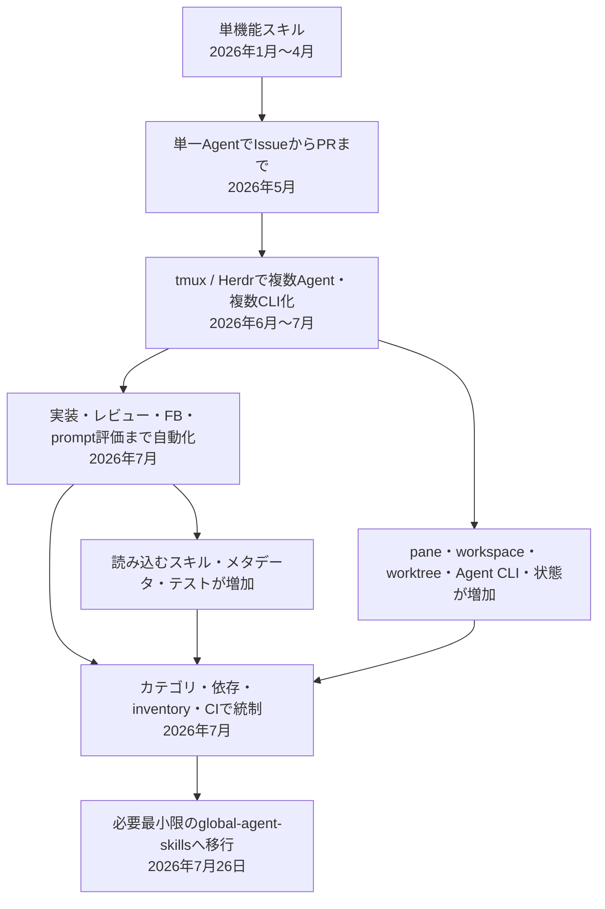

# agent-skills の発展と複雑化、そして移行

この文書は、個人用の小さなスキル集として始まったこのリポジトリが、単一Agentによる一貫自動化、複数Agentのオーケストレーション、厳密なガバナンスへ進み、最終的に必要最小限の構成へ移行するまでの記録です。勉強会やテックブログで再利用できるよう、出来事だけでなく、どこで費用対効果が変わったのかも残します。

対象期間は、最初の commit が作られた 2026年1月19日から、[global-agent-skills への移行を明記した PR #246](https://github.com/u7chan/old-agent-skills/pull/246) が merge された 2026年7月26日までです。

## 全体像

> [!IMPORTANT]
> このリポジトリは、機能を失って自然に衰退したわけではありません。自動化できる範囲は最後まで増えました。一方で、安全かつ再現可能に動かすための契約と検証も増え、個人用ツールとしての保守可能性と費用対効果が低下しました。

## 時系列サマリー

| 期 | 時期 | 到達点 | 同時に増えたもの |
| ---: | --- | --- | --- |
| 1 | 1月〜2月 | 個人用の単機能スキル集 | 責務の粒度を探る試行錯誤 |
| 2 | 3月〜4月 | Claude Code / Codex 両対応 | スキル数、命名・重複整理 |
| 3 | 5月 | 単一Agentで Issue から PR まで完走 | 1つの入口が扱う責務と停止条件 |
| 4 | 6月29日〜7月2日 | tmux による複数Agent化 | Agent間通信、pane、timeout、結合テスト |
| 5 | 7月 | Herdr と複数のAgent CLIによる実装・レビュー・FB ループ | workspace、worktree、親子Agent、CLIごとの起動・状態管理 |
| 6 | 6月〜7月 | Agent / Model / Effort の解決と記録 | 専用CLI、実行値の出所、所有権、伝播規則 |
| 7 | 7月19日〜24日 | inventory・依存規則・35検証ルール | 正本、生成物、fixture、CI の同期 |
| 8 | 7月25日〜26日 | `global-agent-skills` への移行 | 公開入口とロードコストの削減 |

> [!NOTE]
> 本文では、**Git / GitHub で確認できる事実**、リポジトリ外の負荷を含む**運用者の回顧**、両者をつないだ**現在からの解釈**を区別します。日付は、特記がない限り Git 履歴上の merge 日を基準にしています。

## 詳細な時系列

### 1. 小さな個人用スキル集（2026年1月〜2月）

最初は、文字列反転、Git のブランチ名・commit message 提案、ロールプレイなどを置く小さな実験場でした。[PR #1](https://github.com/u7chan/old-agent-skills/pull/1)、[PR #2](https://github.com/u7chan/old-agent-skills/pull/2)、[PR #3](https://github.com/u7chan/old-agent-skills/pull/3) に、その出発点が残っています。

[PR #11「feat: add comprehensive README documentation」](https://github.com/u7chan/old-agent-skills/pull/11) の時点でも、README に載っていた中心機能は commit message 関連の2スキルでした。セットアップも Claude Code のグローバルな skills ディレクトリから symlink する素朴なもので、個人用グローバルスキル管理という目的に対して構成は小さく、全体を目で追えました。

2月末には branch、commit、PR 本文・PR 作成を分割したスキルが揃い始めました。context 用と diff 用の派生を作った直後に統合し直した [PR #29](https://github.com/u7chan/old-agent-skills/pull/29)、[PR #30](https://github.com/u7chan/old-agent-skills/pull/30)、[PR #33](https://github.com/u7chan/old-agent-skills/pull/33) は、早い段階から責務の粒度を試行錯誤していたことを示しています。ただし、まだ各スキルは単機能で、呼び出す側が組み合わせを判断できる規模でした。

### 2. Claude Code / Codex 両対応とプリミティブの充実（2026年3月〜4月）

[PR #41「docs: add Codex skill setup instructions」](https://github.com/u7chan/old-agent-skills/pull/41) と [PR #46「feat: add claude-to-codex skills link skill」](https://github.com/u7chan/old-agent-skills/pull/46) により、Claude Code と Codex の両方から同じスキル群を使う形が整いました。

この時期は、Issue 作成、依存パッケージ更新、ブラウザ確認、PR コメント返信など、用途ごとのプリミティブを増やしながら、命名変更や重複統合を繰り返していました。[PR #57「Refactor skill naming conventions」](https://github.com/u7chan/old-agent-skills/pull/57) や [PR #77「refactor(github-pr-create): consolidate PR creation skills」](https://github.com/u7chan/old-agent-skills/pull/77) が代表例です。

運用者の回顧では、ここまではスキル数が増えても、Claude Code / Codex 両対応を含めて大きな問題はありませんでした。各スキルの入力、処理、出力が比較的局所的だったためです。

### 3. 単一Agentの一貫オーケストレーション（2026年5月）

大きな転換点は、[PR #83「Add github-implement-pr skill」](https://github.com/u7chan/old-agent-skills/pull/83) です。当時の `github-implement-pr` は、Issue の読み取り、branch 作成、実装、検証、commit、push、PR 作成までを1体のAgentが止まらずに進めるスキルでした。初版は他スキルへ委譲せず、1つの長いワークフローの中で完結する設計でした。

これは明確な価値を生みました。「Issue を渡せば PR まで進む」という高い操作性を、単一Agentのセッション内で実現したためです。一方で、Git、GitHub、実装、検証、失敗時の停止条件を1つの入口から扱うようになり、スキルは単なる手順書からワークフローエンジンに近づき始めました。

[PR #84「Add PR feedback address skill」](https://github.com/u7chan/old-agent-skills/pull/84) ではレビュー指摘対応が加わりました。さらに [Issue #114「SKILL.mdを原則180行以内に整理しCIで検証する」](https://github.com/u7chan/old-agent-skills/issues/114) と [PR #115「SKILL.mdを整理し検証CIを追加する」](https://github.com/u7chan/old-agent-skills/pull/115) により、スキル検証の CI が導入されました。自動化の対象だけでなく、自動化を壊さず保守する仕組みも必要になった時期です。

### 4. tmux による複数Agent化（2026年6月29日〜7月2日）

6月末、[PR #132「feat: add tmux Codex split skill」](https://github.com/u7chan/old-agent-skills/pull/132) を起点に、OpenCode / Claude Code の pane 起動、非同期 PR レビュー、Agent間メッセージングが短期間に追加されました。[PR #133「Add tmux split skills for OpenCode and Claude Code」](https://github.com/u7chan/old-agent-skills/pull/133)、[PR #134「feat: add asynchronous PR review handoff」](https://github.com/u7chan/old-agent-skills/pull/134)、[PR #137「feat: add tmux agent payload messaging」](https://github.com/u7chan/old-agent-skills/pull/137) です。#137 では JSON の通信形式、schema、timeout、trace、単体・tmux 結合テストまで導入されました。

しかし tmux 固有スキルは、わずか数日後の [PR #142「chore: archive tmux skills」](https://github.com/u7chan/old-agent-skills/pull/142) で archive されました。そして [Issue #143「herdrで複数Agentへの委譲を統合するスキルを追加する」](https://github.com/u7chan/old-agent-skills/issues/143) と [PR #144「feat: add Herdr agent delegation skill」](https://github.com/u7chan/old-agent-skills/pull/144) により、Herdr ベースへ置き換わりました。

ここで扱う状態は、一気に増えました。親子Agent、pane、tab、workspace、worktree、依頼送信、完了待機、出力回収、失敗時の資源保持などです。さらに、Codex、OpenCode、Claude Code という異なる Agent CLI を同じ委譲フローから起動する必要がありました。運用者の回顧では、Claude Code はサブスクリプション枠を使った運用ではありませんでしたが、対応する Agent CLI の一つとして、起動・送信・完了判定の差を吸収する対象に含まれていました。単一Agentの中だけで成立していた手順に、ターミナルマルチプレクサをまたぐ分散実行と、複数のCLIを共通に扱うための契約が加わりました。

### 5. Herdr による実装・レビュー・FB ループ（2026年7月）

Herdr 導入の翌日には、[PR #148「feat: github-implement-pr に Herdr レビューループを追加」](https://github.com/u7chan/old-agent-skills/pull/148) と [PR #149「feat: github-implement-pr の実装工程を Herdr Agent へ委譲」](https://github.com/u7chan/old-agent-skills/pull/149) が入りました。その後 [PR #151](https://github.com/u7chan/old-agent-skills/pull/151) でスキル名にも Herdr が明示されました。

到達したワークフローは強力でした。親Agentが Issue と作業領域を解決し、実装を子Agentへ委譲し、PR を作成し、別Agentにレビューさせ、対応可能な指摘をさらに別Agentへ渡し、再チェックを繰り返せます。従来の単一Agent用スキルも下位工程として読み込まれました。

委譲先は同じ種類のAgentに限られません。Codex、OpenCode、Claude Code を役割やタスクに応じて使い分ける構成になり、Agent種別だけでなく、CLIごとの引数、入力準備の判定、prompt の渡し方、完了状態を整合させる必要が生じました。複数Agent化は起動数を増やしただけでなく、異なる実行系を一つのオーケストレーションへ収めるための分岐と検証も増やしました。

同時に、Herdr 周辺では次の修正が連続しました。

- **配置と起動**: pane 分割、grid layout、専用 tab、input readiness
- **依頼と回収**: task exchange、長文 prompt、timeout
- **資源管理**: root pane、workspace、`--no-focus` の扱い

Herdr の安定化に関する主な PR を表示

| PR | タイトル |
| ---: | --- |
| [#153](https://github.com/u7chan/old-agent-skills/pull/153) | feat(herdr-agent-delegate): guarantee same-space pane split for delegated agents |
| [#155](https://github.com/u7chan/old-agent-skills/pull/155) | fix(herdr): wait for agent input readiness |
| [#157](https://github.com/u7chan/old-agent-skills/pull/157) | feat(herdr): add role-based session names for delegated agents |
| [#159](https://github.com/u7chan/old-agent-skills/pull/159) | feat(herdr-agent-delegate): add constrained grid layout and plan-first batch delegation |
| [#165](https://github.com/u7chan/old-agent-skills/pull/165) | feat(herdr-agent-delegate): move task exchange directory into workspace |
| [#166](https://github.com/u7chan/old-agent-skills/pull/166) | feat(herdr-agent-delegate): 起動数に応じた専用タブ選択と容量不足フォールバック |
| [#168](https://github.com/u7chan/old-agent-skills/pull/168) | refactor: simplify Herdr delegation primitives |
| [#171](https://github.com/u7chan/old-agent-skills/pull/171) | fix(herdr-agent-delegate): 新規タブの空アンカーpaneを廃止しroot paneを直接Agent起動先にする |
| [#173](https://github.com/u7chan/old-agent-skills/pull/173) | [herdr-agent-delegate] 依頼送信を pane run に統一して確実に実行開始する (#172) |
| [#175](https://github.com/u7chan/old-agent-skills/pull/175) | fix(herdr-agent-delegate): Claude 長文依頼の [Pasted text #1] 発火対応 (#174) |
| [#179](https://github.com/u7chan/old-agent-skills/pull/179) | fix(herdr-agent-delegate): prevent --no-focus from leaking into pane run |
| [#180](https://github.com/u7chan/old-agent-skills/pull/180) | fix(herdr-agent-delegate): extend completion timeout to 30 minutes |

[PR #177「feat: add Herdr prompt evaluation loop」](https://github.com/u7chan/old-agent-skills/pull/177) では、独立Agentを反復起動して prompt を実証評価する仕組みまで加わりました。自動化の対象が開発作業だけでなく、「Agent向け指示が再現可能に動くか」の評価へ広がった段階です。

### 6. Agent / Model / Effort の解決と記録（2026年6月〜7月）

複数の Agent CLI を扱うと、「どのAgentを起動するか」に加えて、「そのタスクをどのModelとEffortで実行するか」もオーケストレーションの責務になります。この選択を各 Herdr スキルへ個別に埋め込まず、タスクレベル、ユーザー指定、設定から実行値を解決するため、7月9日に専用CLI [code-agent-launcher](https://github.com/u7chan/code-agent-launcher) の開発が始まりました。CLI コマンド名は `cagent` です。

[Issue #161「Herdr 上で cagent を使う coding-agent-subagent Skill を追加する」](https://github.com/u7chan/old-agent-skills/issues/161) と [PR #181「feat: cagentを使うcoding-agent-subagent Skillを追加」](https://github.com/u7chan/old-agent-skills/pull/181) では、責務を二つに分けました。`cagent` と連携するスキルが Agent、`low` / `mid` / `high` のタスクレベル、Model、Effort、起動コマンドを解決し、Herdr 側が pane 配置、起動、送信、待機、回収を担当します。これにより選択規則の集約と再利用は進みましたが、Herdr スキルだけでなく、別リポジトリのCLI、その設定、Agentごとの `adapter`、両者をつなぐ契約までが動作条件になりました。

起動値の解決と並行して、作業した Agent と Model を PR 本文やレビューコメントへ残す仕組みも、次の順で発展しました。

| 時期 | 変更 | 主な記録 |
| --- | --- | --- |
| 3月〜5月 | レビューコメントへ Agent / Model を表示 | [#59](https://github.com/u7chan/old-agent-skills/pull/59)、[#113](https://github.com/u7chan/old-agent-skills/pull/113) |
| 6月 | Codex 固定を外し、取得ルールを共通化 | [#129](https://github.com/u7chan/old-agent-skills/pull/129)、[#130](https://github.com/u7chan/old-agent-skills/pull/130) |
| 7月14日 | `cagent` による Agent / Model / Effort と起動コマンドの解決をHerdr委譲へ接続 | [#181](https://github.com/u7chan/old-agent-skills/pull/181) |
| 7月14日 | PR 本文へ役割別の AI work metadata を追加 | [#184](https://github.com/u7chan/old-agent-skills/pull/184) |
| 7月15日〜16日 | runtime model と orchestrator の値を修正 | [#188](https://github.com/u7chan/old-agent-skills/pull/188)、[#192](https://github.com/u7chan/old-agent-skills/pull/192) |
| 7月18日〜19日 | Effort と Herdr 委譲時 snapshot を追加 | [#201](https://github.com/u7chan/old-agent-skills/pull/201)、[#207](https://github.com/u7chan/old-agent-skills/pull/207) |

履歴から確認できるのは、「実行時の Agent / Model / Effort を正しく選び、起動し、表示する」という横断的な関心に対し、短期間に複数の修正が必要だったことです。「だんだん期待どおり動かなくなった」という評価は運用者の回顧ですが、値の出所がユーザー指定、`cagent` の設定と解決結果、親Agent、子Agent、runtime にまたがり、起動値と表示値の契約が不安定になりやすかったことは変更の連続から読み取れます。

### 7. 複雑さを統制するための inventory・規則・検証（2026年7月19日〜24日）

7月後半には、責務分離後に短い「PRを作って」という依頼を完走できなくなった回帰を扱う [Issue #208「[github-pr-orchestrate] 未コミット変更からPR作成まで統括する」](https://github.com/u7chan/old-agent-skills/issues/208) が作られました。その対応である [PR #209「feat: add GitHub PR orchestration skills」](https://github.com/u7chan/old-agent-skills/pull/209) は、Herdr を使わない直接統括と Herdr 統括を分離しました。利用コンテキストごとに入口を分ける合理的な設計でしたが、共通の下位スキルを含む複数のオーケストレーション経路を維持することにもなりました。

続いて、[Issue #206「[Epic] スキル構成の大規模な棚卸しと再編」](https://github.com/u7chan/old-agent-skills/issues/206) の下で、次の整備が行われました。Issue 本文は、責務の重複、依存関係の複雑化、SKILL.md の肥大化、外部依存の把握困難を再編理由として明示しています。

| 段階 | 整備内容 | 記録 |
| --- | --- | --- |
| Phase 1 | skill inventory と依存関係データを追加 | [PR #223「feat: add skill inventory scripts and data for Phase 1 (#214)」](https://github.com/u7chan/old-agent-skills/pull/223) |
| Phase 2 | カテゴリ、依存方向、責務、命名などの正本を定義 | [PR #224「Phase 2: スキル構成・依存ルールの確定」](https://github.com/u7chan/old-agent-skills/pull/224) |
| Phase 3 | 35ルールの検証フレームワークを追加 | [PR #226「feat(validation): add skill validation framework with 35 rule checks」](https://github.com/u7chan/old-agent-skills/pull/226) |
| Phase 4 | カテゴリ別ディレクトリへの再配置とセットアップ処理 | [PR #240「[Epic] スキル構成の棚卸し・再編・カテゴリ再配置」](https://github.com/u7chan/old-agent-skills/pull/240) |
| 再簡素化 | 外部依存種別を廃止し、正本を一本化 | [PR #242「refactor: remove external dependency type annotations (R/C/O/F)」](https://github.com/u7chan/old-agent-skills/pull/242) |

これらは、既に存在する複雑さを可視化し、安全に整理するための対策でした。Phase 1 の初回棚卸しでは、34スキルに対して循環依存2件、逆方向依存の候補16件、物理パス参照22件が記録されています。ただし、対策によって `.rules/`、`inventory/`、生成スクリプト、検証コード、fixture、CI という新たな保守対象も生まれました。機能変更だけでなく、正本、生成物、README、依存グラフ、テストの同期が必要になり、整理のための仕組み自体が認知負荷へ加わりました。

### 8. 最小構成への移行（2026年7月25日〜26日）

[Issue #244「Herdrオーケストレーションスキルを別リポに切り出す」](https://github.com/u7chan/old-agent-skills/issues/244) では、「何でもこのリポジトリで管理すべきではない」という判断と、Herdr 関連をより小さな単位へ切り出す方針が記録されました。翌日の [PR #246「docs: global-agent-skillsへの移行経緯を記録する」](https://github.com/u7chan/old-agent-skills/pull/246) で、このリポジトリをメンテナンス対象から外し、新しい [global-agent-skills](https://github.com/u7chan/global-agent-skills) へ移行する方針が README に明記されました。README が移行先設計の正本として参照しているのは、[global-agent-skills Issue #8「[Epic] AI向けGitHub操作基盤 gh を構築する」](https://github.com/u7chan/global-agent-skills/issues/8) です。

運用者が新リポジトリで残そうとしている公開入口は、概ね次の3つです。

- `gh`: GitHub CLI の低レベル操作を集約するラッパー
- `herdr`: Agent オーケストレーションの低レベル操作を集約するラッパー
- `grilling`: 設計や意思決定を一問ずつ詰める対話スキル

狙いは、機能をすべて捨てることではありません。Agent が最初に読む description と公開スキル数を減らし、共通処理を CLI ラッパーへ寄せ、モデルが読み込むスキル同士の結合を減らすことです。

## 何が費用対効果を変えたのか

### 局所的には、どの追加も合理的だった

以下は、履歴と運用者の回顧をつないだ現在からの解釈です。各段階の追加には、それぞれ明確な理由がありました。

- PR 作成を自動化すると、その後のレビューも自動化したくなる
- レビューを別Agentにすると、pane、送信、待機、回収の共通化が必要になる
- Codex、OpenCode、Claude Code を使い分けると、CLIごとの起動引数と状態判定をそろえる必要がある
- 複数Agentを安全に動かすと、worktree、状態、timeout、失敗時資源の契約が必要になる
- タスクごとにAgentを選ぶと、Model / Effort の解決と実行値の固定が必要になる
- 実行結果を追跡すると、解決した Agent / Model / Effort の正確な伝播と記録が必要になる
- 密結合を整理すると、カテゴリ、依存方向、inventory、検証が必要になる

1つずつを見ると、前段階で実際に起きた問題への対策です。問題は、それらが積み重なったときの全体コストが、個別 PR のレビュー単位では見えにくかったことでした。

### オーケストレーションは、読み込みと状態の組み合わせを増やした

単一のプリミティブスキルでは、主に「入力、コマンド、出力」を考えれば済みます。Herdr 統括では、親Agentと複数の子Agent、GitHub、Git、pane、workspace、worktree、Codex・OpenCode・Claude Code の各CLI、`cagent` によるModel / Effort解決、レビュー状態が相互作用します。

現在の正本では、`herdr-github-pr-orchestrate` は branch、commit、PR 作成、レビュー、FB 対応、Herdr 委譲、worktree の7スキルに依存します。加えて、新規Agentの起動時には `cagent` の解決スキルと外部CLIも関与します。再利用によって重複実装は減りますが、実行時には複数の `SKILL.md` と `references/` を読み、リポジトリをまたぐ境界条件を同時に守る必要があります。コードの関数呼び出しに似た依存関係を自然言語 prompt と外部CLIで構成したため、ロードする文脈、解釈の揺れ、バージョン間の契約が実行コストになりました。

### 品質保証が、個人用ツールの規模を越えた

移行決定時点のスナップショットは次のとおりです。行数はコメントや fixture を含む単純集計であり、品質や複雑さを直接測る指標ではありません。

| 対象 | 規模 |
| --- | ---: |
| commit | 262（うち147、約56%が2026年7月） |
| Git 管理ファイル | 204 |
| スキル | 配布対象33 + リポジトリ保守専用1 |
| orchestration カテゴリ | 7スキル |
| 正本に記録されたスキル依存 | 19本 |
| `.rules/` の2ファイル | 1,398行 |
| `inventory/` の4 YAML | 1,416行 |
| inventory 生成・検証コード | 3,069行 |
| Python テスト | 18ファイル、2,094行 |
| orchestration 配下の Markdown / Python | 3,025行 |

この表は `old-agent-skills` だけの集計であり、`code-agent-launcher` 本体の実装、テスト、設定、リリース作業は含みません。複雑さの一部を専用CLIへ移したことで個々のスキルの責務は整理されましたが、運用者が保守するシステム全体の範囲は、このリポジトリの外側まで広がっていました。

これは「テストや規則を作るべきではなかった」という意味ではありません。むしろ、自然言語で書かれた分散ワークフローを安定させようとすれば、契約テストや静的検証が必要になることを示しています。問題は、個人用スキル集の価値を得るために、専用フレームワークに近い保守を必要とする状態へ達したことです。

### トークンと Usage は、リポジトリの外側にある主要コストだった

Git 履歴だけから、実際のトークン数や Codex Usage は復元できません。以下は運用者の回顧です。

- 終盤のフローは Issue から実装、PR、レビュー、FB 対応、再チェックまで自動化できた
- その代わり、親子Agentが複数スキルと GitHub 情報を読み、成果を受け渡すため、トークン消費が大きくなった
- 複数タスクを並列実行すると、1日で Codex の Usage を使い切るほど費用対効果が悪化した
- 公開スキルの description が増えただけでも、毎セッションの初期ロードコストになった

このコストは CI のようにリポジトリ上へ自動記録されていませんでした。そのため、機能の増加は追跡できても、1タスクあたりのトークン、Agent起動数、待ち時間、成功までの再試行数は設計判断へ戻しにくい状態でした。

なお、[Issue #34「skillsのdescription英語化によるトークン使用量削減の検証」](https://github.com/u7chan/old-agent-skills/issues/34) のコメントには、LiteLLM Proxy を使った特定条件の測定で、日本語の description が英語より約105 prompt tokens 多かったという記録があります。一般化できる数値ではありませんが、description のロードコストを早い段階から意識していた例です。

## 得られた教訓

1. **自動化できる範囲と、持続可能な範囲は違う** — Issue からレビュー FB ループまで自動化できたこと自体は成果です。ただし、「できる」ことと「毎日使って得をする」ことは別でした。1タスクのトークン、時間、失敗時の復旧負荷まで含めて評価する必要があります。

2. **自然言語の依存関係にも API 設計が要る** — スキル間参照が増えると、名前、責務、入力、出力、失敗状態、再試行、cleanup が API になります。公開する入口を少なくし、定型処理を CLI へ寄せる方が、モデルへ渡す契約を小さくできます。

3. **「整理する仕組み」の予算を先に決める** — カテゴリ、inventory、依存グラフ、検証ルールは複雑さを可視化しますが、それぞれが新しい同期対象です。ガバナンスコードにも規模、変更頻度、修正時間の上限や廃止条件が必要でした。

4. **モデル実行時情報は、起動前に出所を一意にする** — Agent / Model / Effort を表示する前に、ユーザー指定、ランチャーの解決値、親と子、設定値と実行値のどれを正本にするか決める必要があります。表示から着手すると、選択、起動、取得、伝播の規則が後追いになります。

5. **並列化は速度だけでなく、消費量も並列化する** — 複数Agentは待ち時間を短縮する一方、背景説明、スキル読み込み、GitHub 情報取得、検証も複製します。独立性が高く、受け渡しが小さい仕事だけを並列化する基準が必要です。

6. **移行は、抽象化の置き場所を変える判断である** — 旧リポジトリの知見があるからこそ、`gh` と `herdr` のような薄いラッパーへ共通処理を寄せ、公開スキルを絞れます。このリポジトリは、どの抽象化が自然言語スキルに向き、どれが CLI に向くかを示す実験記録として残します。

## 勉強会・テックブログに展開できる問い

- 「Issue から PR まで全自動」の本当の運用コストをどう測るか
- Agent Skill を関数のように合成すると、どこでマイクロサービス的な複雑さが生まれるか
- prompt の契約テストはどこまで有効で、いつ専用フレームワーク化するか
- マルチAgentは何を並列化すると得で、何を並列化すると文脈の重複になるか
- 複数の Agent CLI を共通化するとき、複雑さは減るのか、別の層へ移るだけなのか
- Agent / Model / Effort の provenance を、親子Agent間でどう保持するか
- 個人用自動化に、組織向けガバナンスを持ち込む境界はどこか
- 「追加する PR」だけでなく「公開入口を減らす PR」をどう評価するか

## 終わりに

このリポジトリの歴史は、単純な「作りすぎて失敗した」話ではありません。小さな不便を解消するスキルが、実装を完走するワークフローになり、複数Agentの協調系になり、それを安定させるルールと検証基盤へ育った記録です。

その過程で、自動化の能力は上がりました。しかし個人が理解し、直し、日常的に安価に使えるという最初の価値は薄くなりました。次のリポジトリでは、ここで得た機能ではなく、境界の学びを持ち越します。
